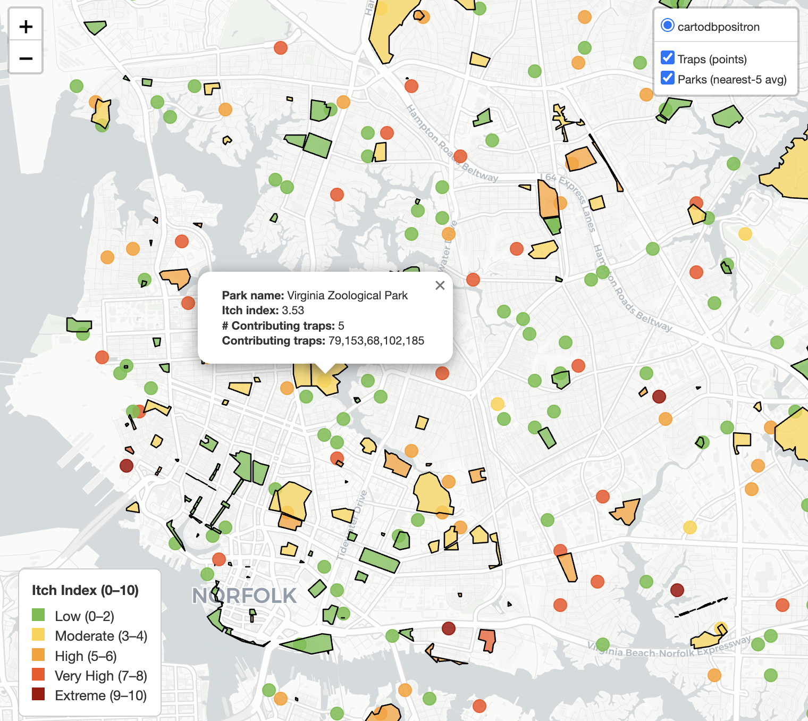
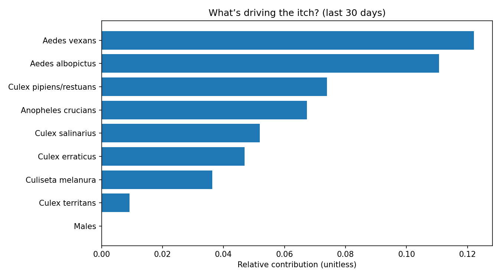
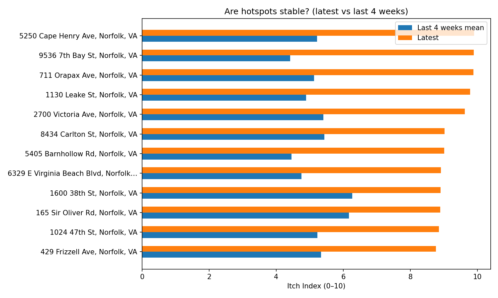

# Itch Index for Hampton Roads (0–10)

A UV-style index that translates mosquito surveillance into a simple number people can use to choose protection for parks and green spaces.

<p align="center"> <a href="https://domsoos.github.io/itch_map.html">  </a><br> <em>Click the image to open the interactive Itch Map</em> </p> <p align="center"> <a href="https://domsoos.github.io/itch_map.html">  </a> </p>


## Repo structure
```bash
/data
  Hampton_Roads_NWI_Wetlands.csv
  Mosquito_Trap_Counts_YYYYMMDD.csv
/src
  itch_index.py          # builds the index + exports CSV/PNGs/heatgrid
  make_itch_story.py     # builds narrative visuals + banded folium map
/outputs
/outputs_story
```
## Installation
```bash
python3 -m venv .venv && source .venv/bin/activate
pip install pandas numpy matplotlib folium
```

<details>
<summary><strong>How the Itch Index (0–10) is calculated</strong> — science in short (click to expand)</summary>

Per trap reading, we compute a biologically plausible **base risk** and then map it to the familiar **0–10** UV-style scale.

- **Abundance (saturating)**  
  `abundance = sqrt(count) / (sqrt(count) + K_trap)`  
  where `K_trap = p70(sqrt(count))` *within the same trap type* (BG, Gravid, CDC).  
  This fairly compares different trap methods and reflects diminishing returns.

- **Species weight (who bites humans?)**  
  `species_weight ∈ [0, 0.95]`  
  Examples: *Aedes albopictus* ≈ `0.95`; *Aedes* spp. `0.9`; *Anopheles* `0.7`; *Culex* `0.6`; **Males = `0`**.

- **Recency (fresh catches matter most)**  
  `recency = 0.5 ** (days_since / 12)`  (12-day half-life)

- **Habitat nudge (wetland suitability)**  
  Region-wide multiplier from NWI wetlands:  
  `habitat_multiplier ∈ [0.95, 1.15]`

- **Base risk**  
  `base = abundance * species_weight * recency * habitat_multiplier`

- **Calibration to 0–10 (stable & readable)**  
  Piecewise quantile mapping over the last **60 days** (excluding “Males”):  
  `q10 → 2`, `q50 → 5`, `q90 → 8.5`, `q99 → 10` (linear between anchors).

</details>


## Run the pipeline
```bash
python3 src/itch_index.py \
  --traps data/Mosquito_Trap_Counts_20251017.csv \
  --wetlands data/Hampton_Roads_NWI_Wetlands.csv \
  --outdir outputs
```
## Outputs


- ```outputs/itch_index_by_trap.csv``` — per trap reading (with components)
- ```outputs/itch_index_latest_by_location.csv``` — latest score per site
- ```outputs/itch_index_scatter.png``` — latest map scatter (static)
- ```outputs/itch_index_bar_top_sites.png``` — top latest sites
- ```outputs/itch_index_heatgrid.csv``` — coarse IDW grid for choropleths


## Build the visuals
```bash
python3 src/make_itch_story.py \
  --latest outputs/itch_index_latest_by_location.csv \
  --bytrap outputs/itch_index_by_trap.csv \
  --outdir outputs_story
```

## Story outputs

- ```fig_hist_latest.png``` — distribution across UV-style bands
- ```fig_trend_rolling.png``` — 14-day mean / 95th / max
- ```fig_species_contrib.png``` — top species (bite-weighted, recent 30 days)
- ```fig_hotspot_stability.png``` — latest vs last-4-weeks at same sites
- ```fig_traptype_box.png``` — sanity check by trap type
- ```itch_map_banded.html``` — interactive map with discrete band colors

<table> <tr> <td width="50%">  </td> <td width="50%">  </td> </tr> </table>

# Interpreting the Itch Index

- ```0–2 Low``` – low nuisance risk
- ```3–4 Moderate``` – repellent recommended for dusk/dawn
- ```5–6 High``` – repellent + socks/long sleeves near vegetation
- ```7–8 Very High``` – avoid marsh-edge trails at dusk; event caution
- ```9–10 Extreme``` – strong protection; consider advisories

## Design choices

Saturating abundance matches how human nuisance rises then levels off

Species & recency reflect who bites and how quickly conditions change

Wetlands add ecology without swamping signal

Quantile anchoring keeps the scale stable and readable over time

## Next steps

Weather nowcasting (rain/temp/humidity) to bridge days between traps

Park-polygon scores & public dashboard

Optional per-species advisory (e.g., daytime Aedes vs nighttime Culex messaging)
